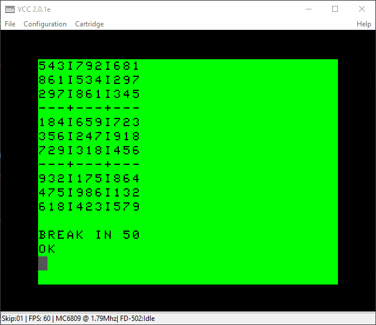

# SUDOKU-COCO3
A Sudoku puzzle generator written in Extended Color Basic.

This program was tested in VCC 2.0.1e.

It takes about 3.5 minutes at the default CPU speed to create a grid.  Use CONT at the break to continue with puzzle generation.

It takes *much* longer to find the right numbers to remove from the grid.  I maxed out the overclock parameter in Vcc and the program has still been running all afternoon, steadily removing one cell after another.  But it works.  Each successive iteration takes a little bit longer than the one before.

The FILLGRID: and SOLVEGRID: subroutines both use backtracking algorithms to figure out the grid.  This is tricky in Extended Color Basic, where all of the variables are globally scoped:  The run context was being clobbered on each recursive call to the subroutine.  I solved this using the ST/SP variables to implement an integer stack.  Before allowing a subroutine to call itself I push the current state of the subroutine onto the stack, then pop it off the stack just after the GOSUB.  This took some trial and error to figure out how big to make ST, and it could probably be made a bit smaller.

## Subroutines

| Name                | Line # |Purpose
|---------------------|-------:|--------
| DRAWGRID:           |    100 | Draw the contents of the grid to the screen.
| CHECKGRID:          |    200 | Is the grid completely filled in?  Sets T to 0, 1.
| SHUFFLE:            |    300 | Create a randomized set of digits from 1-9; sets SF to the shuffled list.
| FINDFIRSTEMPTYCELL: |    400 | Find the first grid cell <> 0; sets R, C to the row & column.
| ISNUMBERINCOLUMN:   |    500 | Check for a number N in column C.  Sets T to 0, 1.
| ISNUMBERINROW:      |    600 | Check for a number N in row R.  Sets T to 0, 1.
| ISNUMBERINSQUARE:   |    700 | Check for a number N in the 3x3 square that contains (R, C).  Sets T to 0, 1.
| FILLGRID:           |    800 | Create a completely Sudoku grid.  Sets G and T.
| SOLVEGRID:          |    900 | Find the # of solutions to a Sudoku grid.  Modifies G, CT, and T.
| COPYGRID:           |   1000 | Copy the contents of G into CG.
| RESTOREGRID:        |   1100 | Copy the contents of CG into G.
| SPARSIFYGRID:       |   1200 | Erase elements of G while retaining a single-solution grid.

## Variables

| Name | Purpose
|------|---------
| ST   | Integer stack.
| SP   | Stack pointer; current index into ST
| G    | The Sudoku grid.
| CG   | A copy of the grid; used when determining if a cell can be erased.
| SS   | An array of digits used when created a shuffled number set; used in SHUFFLE:.
| SF   | A shuffled array of digits; created by SHUFFLE:.
| T    | Used for a true/false return value from subroutines.  0=false, 1=true.
| CT   | Used to count the number of solutions to a grid.

## TODO

* It might be more more efficient to use some PEEK/POKE commands along with the stack pointer instead of using an array.
* This algorithm runs fairly quickly in Python.  How fast will it run in 6809 assembly?
* If I can get the runtime down to something reasonable, I can add a UI and turn this into an actual game.

